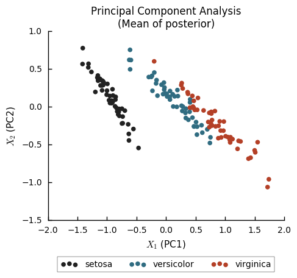
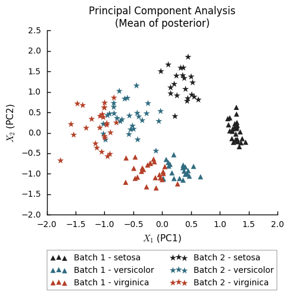

# PCA with batch effects in Stan

In [Principal Component Analysis](https://www.microsoft.com/en-us/research/publication/probabilistic-principal-component-analysis/) (PCA), we wish to find a simple linear model that explain multidimensional data. If we have $ G $ variables:

$$
\require{color}
\begin{align}
y^g &= {\color{red} w_1^g} \cdot {\color{red} x_1}
+ {\color{red} w_2^g} \cdot {\color{red} x_2}
+ {\color{red} \mu^g} + \varepsilon \\
\varepsilon &\sim 
\mathcal{N}(0, {\color{red} \sigma^2}) \\
g &\in \{1, \ldots, G\}
\end{align}
$$

The red parts of the formula indicate quantities we need to infer from
the data.

Let us look at an example and a simple implementation.

As an illustratory data set, let us use the classical [_Iris_ data set]
(https://en.wikipedia.org/wiki/Iris_flower_data_set).
This consists of 150 observations of four measurements (sepal length, sepal width, petal length, and petal width) of three species
of Iris flowers (_I. setosa_, _I. versicolor_, and _I. virginica_).

To implement PCA, we use [Stan](http://mc-stan.org/),
a probabilistic programming language, where
you just write out the model, and the inference is handled automatically.
In the C++ based notation of Stan, the PCA model described above is written
in the following way:

```
data {
    int<lower = 1> N;  // Number of samples
    int<lower = 1> G;  // Number of measured features

    vector[G] Y[N];    // Data
}
parameters {
    vector[2] X[N];
    vector[G] mu;
    matrix[G, 2] W;

    real<lower = 0> s2_model;
}
model {
	// "For every sample ..."
    for (n in 1:N){
        Y[n] ~ normal(W * X[n] + mu, s2_model);
    }
}

```

The typical way to use Stan is Bayesian analysis, where you define your model
in Stan along with your priors (which by default, like here, will be uniform)
and use Stan to draw samples from the posterior. For these examples though,
I'll just use Stan's ability to find penalized maximum likelihood (PML) 
estimates of parameters using gradient descent.



From this we can see that _I. setosa_ is quite different from the other two
species, which are harder to separate from each other.

Now imagine that the iris data was collected by two different researchers. One of of them has a ruler which is off by a bit compared to the other. This would cause a so called _batch effect_. This means a global bias due to some technical variation which we are not interested in.
 
Let us simulate this by randomly adding a 2 cm bias to some samples:

```
batch = np.random.binomial(1, 0.5, (Y.shape[0], 1))
effect = np.random.normal(2.0, 0.5, size=Y.shape)
Y_b = Y + batch * effect
```

Now we apply PCA to this data set `Y_b` the same way we did for the original data `Y`.



We see now that our PCA model identifies the differences between the batches. But this is something we don't care about. Since we know which researcher measured which plants, we can include this information in model. Formally, we 
can write this out in the following way:

$$
\begin{align}
y^g &= 
{\color{red} v^g} \cdot {z}
+ {\color{red} w_1^g} \cdot {\color{red} x_1}
+ {\color{red} w_2^g} \cdot {\color{red} x_2}
+ {\color{red} \mu^g} + \varepsilon \\
\varepsilon &\sim 
\mathcal{N}(0, {\color{red} \sigma^2}) \\
g &\in \{1, \ldots, G\}
\end{align}
$$

In our case, we let $ z $ be either 0 or 1 depending on which batch a sample belongs to.

We can call the new model _Residual Component Analysis_ (RCA), because in 
essence the residuals of the linear model of the batch is being further 
explained by the principal components. These concepts were explored much more
in depth than here by [Kalaitzis & Lawrence, _2011_]
(https://arxiv.org/abs/1106.4333).

Writing this out in Stan is straightforward from
the PCA implementation.

```
data {
    int<lower = 1> N;
    int<lower = 1> G;
    int<lower = 0> P;  // Number of known covariates

    vector[G] Y[N];
    vector[P] Z[N];    // Known covariates
}
parameters {
    vector[2] X[N];
    vector[G] mu;
    matrix[G, 2] W;
    matrix[G, P] V;

    real<lower = 0> s2_model;
}
model {
    for (n in 1:N){
        Y[n] ~ normal(W * X[n] + V * Z[n] + mu, s2_model);
    }

}

```

We apply this to our data with batch effects, and plot the fitted $ X $ values again.


Now we reconstitute what we found in the data that lacked batch effect,
_I. setosa_ separates more from the other two species. The residual
components $X_1$ and $X_2$ ignores the differences due to batch.

### Discussion

Note that the batch effect size $v^g$ here is different for each feature
(variable). So this would equally well apply if e.g. the second researcher had
misunderstood how to measure petal widths, causing a bias in only this 
feature. There is also nothing keeping us from including continuous values
as known covariates.

Typically when batch effects are observed, at least in my field, a regression
model is first applied to the data to "remove" this effect, then further
analysis is done on the residuals from that model.

I think this kind of strategy where the known information is added to a
single model is a better way to do these things. It makes sure that your model
assumptions are accounted for together.

A weird thing I see a lot is people trying different methods to "regress out"
batch effects, and then perform a PCA of the result to confirm that their
regression worked. But if your assumption is that PCA, i.e. linear models,
should be able to represent the data you can include all your knowledge
of the data in the model. The same goes for clustering.

A thing to note here, is that the PML estimation of the principal components
I have used is not very good for finding the optimial fit. There are lots 
of parameters (2 * 150 + 4 * 3) and it's very easy to end up in a local optimum. Principal component analysis is very powerful because it has a very
well known optimal solution (eigendecomposition of covariance matrix).

However, writing the models in Stan like this allows you to experiment
with different variations of a model, and the next step would then be to try
to find a good fast and stable way of inferring the values you want to infer.

The code for producing these restults is available at [https://github.com/Teichlab/RCA](https://github.com/Teichlab/RCA).